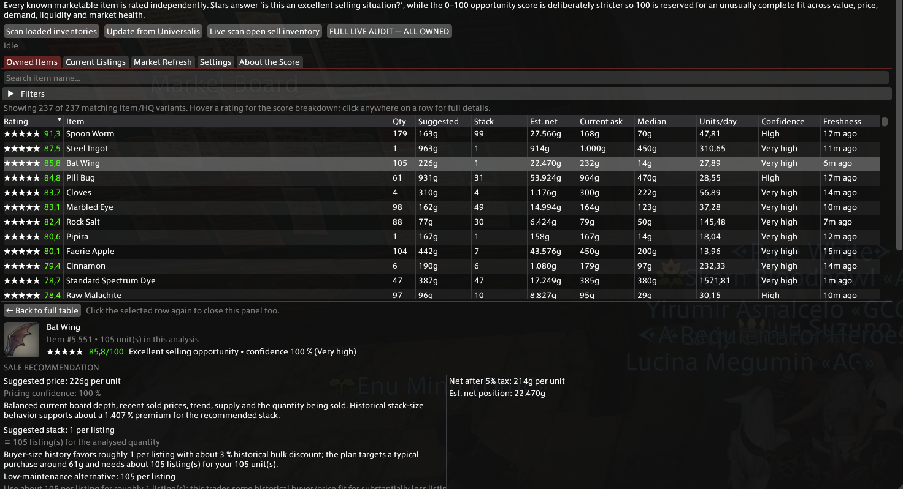
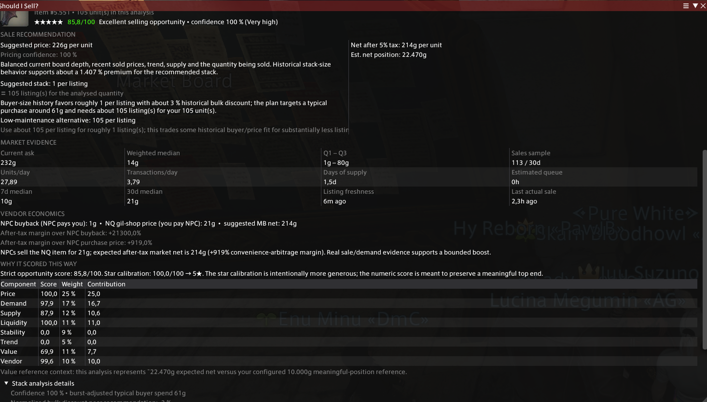

<p align="center">
  
</p>

# Should I Sell?

**Should I Sell?** is an experimental Dalamud plugin for Final Fantasy XIV that turns your owned inventory into a practical Market Board selling audit.

It combines live FFXIV Market Board observations, Universalis history, supply/demand, price stability, vendor economics, after-tax value, and historical stack-size behavior to answer three useful questions:

> **Is this worth selling now?**  
> **What price should I list it at?**  
> **How many should I put in each listing?**

The plugin rates each known marketable item you own, recommends an executable **Suggested price** and **Stack size**, estimates your after-tax payout, and tracks the quality of your current retainer listings.

<p align="center">
  
</p>

<details>
<summary><strong>Detailed item analysis preview</strong></summary>

<p align="center">
  
</p>

</details>

## Features

- **1–5 star sell rating** plus a stricter **0–100 opportunity score**.
- **Suggested Market Board price** based on recent actual sales, current listing depth, trend, supply and demand.
- **Suggested stack size** using historical buyer quantities, convenience premiums, buyer spend, sell-through and fragmentation cost.
- **Low-maintenance stack alternative** when fewer listings may be worth a small pricing tradeoff.
- **Expected after-tax payout per recommended listing** so the overview reflects what one actual sale/listing is worth; full-stock value remains visible in details.
- **Current Listings** audit with listed quantity, listed price, expected payout, suggested price and repricing delta.
- **Vendor economics**:
  - NPC buyback acts as a strong gil floor.
  - normal gil-vendor prices can identify evidence-backed convenience arbitrage.
- **FULL LIVE AUDIT — ALL OWNED** walks every known marketable owned item through the in-game Market Board one by one for fresh data.
- **Universalis history** provides deeper historical context and stack-behavior evidence.
- **Persistent ownership snapshots** allow unloaded retainers and saddlebags to remain part of future audits after the game has exposed them once.
- **Sortable and filterable tables**, row detail inspector, item icons and hover explanations.
- **Already-listed highlighting** — owned items with cached current retainer listings are gold-tinted in the overview.
- **Right-click Suggested price to copy** the raw gil number directly to the clipboard.

- **Personal Sales History** — opening a retainer's **View sale history** captures exact recent personal sales (date/time, buyer, quantity and after-tax net gil), stores them locally, and builds item-level earnings stats with icons.

## Installation — custom Dalamud repository

Add this repository URL to Dalamud:

```text
https://raw.githubusercontent.com/JustPixelll/ShouldISell/main/pluginmaster.json
```

Then:

1. In FFXIV, run `/xlsettings`.
2. Open the **Experimental** tab.
3. Find **Custom Plugin Repositories**.
4. Paste the URL above into an empty row.
5. Click the **+** button, then **Save and Close**.
6. Run `/xlplugins`.
7. Search for **Should I Sell?** and install it.
8. Follow the **First-time setup** below before judging the audit results.

---

# First-time setup — important

FFXIV does **not** keep every inventory container loaded at all times. Should I Sell? can only discover a retainer, saddlebag or market-listing container after the game itself has loaded it at least once.

For the best first audit, do this once after installing:

1. Run `/sellcheck` and leave the plugin open for a few seconds.
2. Open your normal inventory. Player inventory is normally available automatically.
3. Open your **Chocobo Saddlebag** and leave it open briefly.
4. If you have **Premium Saddlebags**, open them too.
5. Visit a **Summoning Bell**.
6. Select **every retainer one by one** and let its inventory load for a moment.
7. For retainers that use the Market Board, open the retainer's market/sell interface as well so the plugin can observe its current listings and listing prices.
8. After every inventory source has been exposed once, run:

```text
/sellcheck fetch
```

This refreshes deeper Universalis history for the marketable items the plugin now knows you own.

9. Then run a full live audit:

```text
/sellcheck audit
```

or press **FULL LIVE AUDIT — ALL OWNED** in the Market Refresh tab.

The full live audit intentionally queries items **one at a time** and ignores cached freshness. With the default pacing, a few hundred unique items can take roughly **10–20+ minutes** depending on network responses and retries. For the cleanest run, avoid manually searching the Market Board while the audit is active.

Once a retainer or saddlebag has been observed, its snapshot is persisted locally, so you do not need to reopen everything before every normal audit. Reopen containers when their contents have changed and you want the cached ownership snapshot updated.

## Recommended basic workflow

### Quick check while selling

1. Open the normal **Sell items in your inventory on the market** or retainer sell window.
2. Open Should I Sell?.
3. Use **Live Scan Open Sell Inventory** to refresh exactly that currently visible selling scope.
4. Sort/filter the Owned Items table.
5. Click any row to inspect the reasoning.
6. Right-click **Suggested** to copy the raw price and paste it into the Market Board price field.
7. Use **Stack** as the recommended quantity per listing; hover it for the low-maintenance alternative.

### Full inventory audit

Use **FULL LIVE AUDIT — ALL OWNED** when you want a fresh ranking of everything the plugin knows you own. This is especially useful after loading all retainers/saddlebags or after a major market change.

### Review existing listings

Open each active retainer occasionally, then use the **Current Listings** tab to review:

- listed quantity,
- current listed price,
- expected after-tax payout,
- recommended price,
- recommended stack size,
- price-change suggestion,
- known time listed and price age.

Existing listings can only be timed from the first moment Should I Sell? observes them; FFXIV does not expose their original server-side listing timestamp.

## Meaningful listing value

The **Meaningful listing value** setting is *not* a minimum acceptable price per item and it is *not* the value of your entire stockpile.

It means:

> **How much expected after-tax gil should one recommended listing be worth before the selling effort feels meaningfully worthwhile to me?**

Example with a setting of **10,000 gil**:

- If the model recommends **1 × 100g net**, the Value component is very low even if you own 100 of the item, because realizing the whole position would require many separate listings.
- If the model recommends **100 × 100g net**, that one listing is worth about 10,000g and sits near the neutral Value point.
- A recommended listing worth ~100,000g is strongly positive on absolute value.

This only affects the **Value** part of the opportunity model. A cheap item can still be a very good market if demand, supply and pricing are excellent. Recommendations that require very large numbers of separate listings also receive a mild execution-friction penalty so a 100-click selling plan does not rank like a frictionless one-listing sale.

## Sales History

The **Sales History** tab is your personal local selling ledger. It is populated when you open a retainer's **View sale history** window. For each exact sale Should I Sell? can capture:

- item and HQ state,
- quantity,
- exact sale timestamp,
- buyer name,
- retainer name,
- and the after-tax gil actually deposited to the retainer.

The overview groups sales by item/HQ variant and shows net earned, transaction count, units sold, net per unit, average sale, best sale and last-sale date, plus fun summary stats such as top earner and best day. Click an item to see its individual transactions.

The game only sends a limited recent sale-history window when opened (normally up to 20 rows per retainer). The plugin cannot reconstruct older sales that were already outside that window on first install, but repeated visits are deduplicated and new rows accumulate locally over time. Buyer names remain in your local plugin data file.

## Stars, numeric rating and confidence

These intentionally mean different things:

- **★★★★★** = broad practical opportunity band. Five stars means an excellent selling situation and can be reasonably common.
- **0–100** = stricter ranking. A `★★★★★ 88` can be excellent; `100` is reserved for an unusually complete opportunity where nearly everything lines up.
- **Confidence** = evidence quality. It is separate from the opportunity score.

## Main table columns

Hover any header in-game for a shorter explanation.

- **Rating** — stars + strict 0–100 sell-opportunity score.
- **Qty** — total known owned quantity across loaded/cached ownership snapshots.
- **Suggested** — gross per-unit price recommended for a realistic sale; right-click to copy.
- **Stack** — recommended quantity per listing.
- **Est. net** — expected after-tax payout of **one recommended listing**: recommended stack size × net suggested unit price. The full known-stock value is still shown in the detail view.
- **Current ask** — realistic current board price after shallow/anomalous listing handling.
- **Median** — recency-weighted median of actual historical sales.
- **Units/day** — recent estimated unit velocity.
- **Confidence** — quality/quantity/freshness of evidence.
- **Freshness** — age of the latest current-board observation.

Current Listings additionally includes:

- **Listed qty** — quantity in that exact live retainer listing.
- **Listed price** — current gross per-unit listing price.
- **Exp. payout** — estimated after-tax payout if that exact listing sells at its current price.
- **Change** — suggested repricing delta compared with your current listed price.

## Score model

| Component | Weight |
|---|---:|
| Price attractiveness | 25% |
| Demand | 17% |
| Supply | 12% |
| Liquidity | 11% |
| Stability | 9% |
| Trend | 5% |
| Expected recommended-listing value | 11% |
| Vendor economics | 10% |

Vendor economics can additionally apply stronger safeguards when Market Board proceeds are worse than guaranteed NPC buyback.

## Data sources

1. Live FFXIV inventory/retainer containers and Market Board packets.
2. Local persisted snapshots for unloaded retainers/saddlebags.
3. Universalis current listings/history as bulk/history fallback.
4. Local Lumina game sheets for item metadata and gil-vendor economics.

Live FFXIV market observations take priority over older Universalis current data.

## Commands

- `/sellcheck` — open the plugin window.
- `/sellcheck scan` — snapshot currently loaded owned-item containers.
- `/sellcheck fetch` — force a Universalis refresh for known marketable owned items.
- `/sellcheck refresh` — refresh stale known owned items through FFXIV.
- `/sellcheck livescan` — force-refresh the currently open player/retainer sell scope.
- `/sellcheck audit` — force-refresh every unique marketable item in all known ownership snapshots.
- `/sellcheck stop` — stop the live Market Board queue.

## Building from source

Requirements:

- Windows
- XIVLauncher/Dalamud installed and run at least once
- .NET 10 SDK

Build with:

```powershell
dotnet build .\ShouldISell\ShouldISell.csproj -c Release
```

`Dalamud.NET.Sdk` / `DalamudPackager` creates the release package automatically for Release builds. Look under the project's `bin` directory for the generated `latest.zip`.

## Release model

This repository is a **custom Dalamud repository**, not an official mainline Dalamud plugin. GitHub Actions builds the plugin against the current Dalamud distribution when a GitHub Release is published, uploads `latest.zip`, and updates `pluginmaster.json` for that release.

See [RELEASING.md](RELEASING.md) for the maintainer workflow.

## Important notes

- This is an experimental market-analysis helper, not a guarantee that an item will sell at a particular price or within a particular time.
- Full live audits use patch-sensitive native Market Board request structures and intentionally pace requests one at a time.
- The displayed after-tax values use a conservative **5% seller-tax assumption**. Actual proceeds may be slightly better at reduced-tax locations.
- Current-listing age is tracked from the first observation by this plugin when the original server-side creation time is unavailable.
- FFXIV/Dalamud patches can change native structures or APIs and may temporarily break live auditing until the plugin is updated.
- This is an unofficial third-party project and is not affiliated with or endorsed by Square Enix, XIVLauncher, Dalamud, or Universalis.

## Credits

- [Dalamud](https://github.com/goatcorp/Dalamud)
- [FFXIVClientStructs](https://github.com/aers/FFXIVClientStructs)
- [Universalis](https://universalis.app/) and its public API

Development was iterative and AI-assisted, with behavior validated through in-game testing.

## License

BSD 3-Clause. See [LICENSE](LICENSE).
